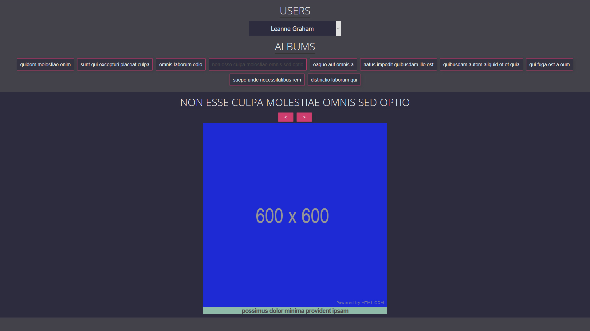

# About

Album Viewer lets you select a user for whom it shows the photos associated with each album that the user likes. The photos are displayed in an in-built JavaScript slideshow.

The data is requested from [JSONPlaceholder](https://jsonplaceholder.typicode.com).

 Selecting a User from the dropdown:
 
 
 Selecting one of the Albums the user likes:
 
 
 Clicking through the slideshow to view the various photos from that album. The title of the photo is shown beneath the album photo.
 

# Start

## 1.0 Install Node Modules

- `npm install`

## 2.0 Development

- Run: `npm run start`
- Navigate to [http://localhost:3000](http://localhost:3000) in your browser.
